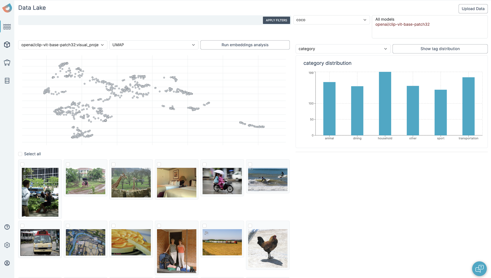

<p align="center">
    
</p>
<p align="center">
    <a href="https://dioptra.ai">Website</a> •
    <a href="https://dioptra.gitbook.io/dioptra-doc/EIKhoPaxsbOt062jkPon/">Docs</a> •
    <a href="https://app.dioptra.ai/register">Try it Now</a>
</p>

<p align="center">
    <b>The open-source data lake for gen ai, computer vision and nlp</b>
    
</p>

# Getting Started

1. Clone this repo
    ```bash
    git clone --recurse-submodules git@github.com:dioptra-ai/katiml.git
    ```
1. Start all services with docker-compose
    ```bash
    cd katiml
    touch .env
    docker compose up --build
    ```
1. If you're starting for the first time, run the schema migration
    ```bash
    cd services/ingestion/schemas/pgsql
    virtualenv .venv && source .venv/bin/activate && pip install -r requirements.txt
    alembic upgrade head
    ```
1. Visit http://localhost:4004/ with the following default credentials
    * username: `admin@dioptra.ai`
    * password: `password`
2. Upload the [example data](./data/sample_dataset.json) to the lake
3. Select all datapoints and add them to a new dataset
4. From http://localhost:4004/data-lake, Run the embedding analysis
