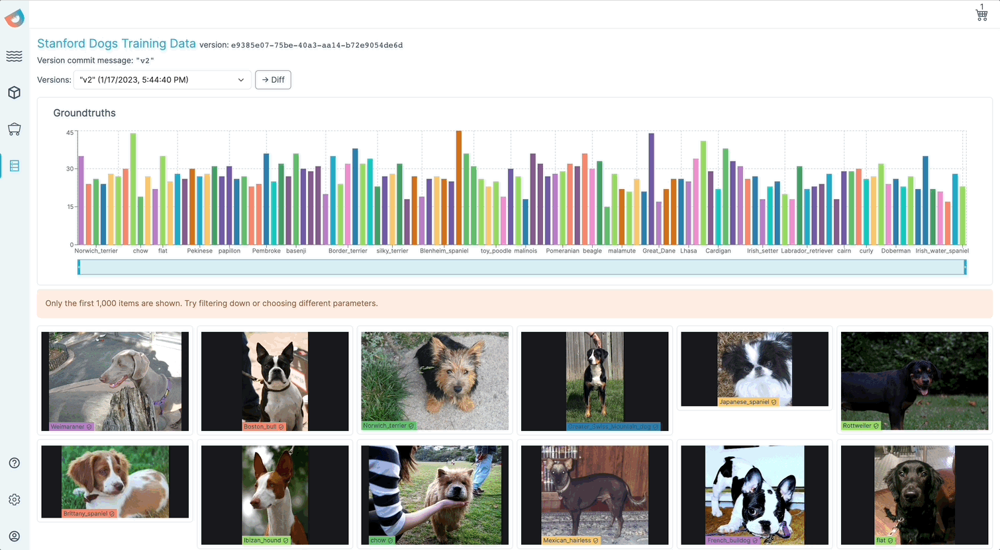

<p align="center">
    <a href="https://dioptra.ai"></a>
</p>

<p align="center">
    <b>The open-source data lake for gen ai, computer vision and nlp</b>
</p>

<p align="center">
    
    <a href="https://pypi.org/project/dioptra/"></a>
    <a href="https://dioptra.gitbook.io/dioptra-doc/EIKhoPaxsbOt062jkPon/"></img></a>
    <a href="https://app.dioptra.ai/register"></a>
</p>

<p align="center">
    </img><a href="https://join.slack.com/t/dioptracommunity/shared_invite/zt-1wepy2rcy-pg1YlMdhT0kz8X_evxteSA"></a>
</p>

<p align="center">
    
</p>


# Start the service

1. Clone this repo
    ```bash
    git clone --recurse-submodules git@github.com:dioptra-ai/katiml.git
    ```
2. Start all services with docker-compose
    ```bash
    cd katiml
    touch .env
    docker compose up --build
    ```
3. If you're starting for the first time, run the schema migration
    ```bash
    cd services/ingestion/schemas/pgsql
    virtualenv .venv && source .venv/bin/activate && pip install -r requirements.txt
    alembic upgrade head
    ```
4. Visit http://localhost:4004/ with the following default credentials
    * username: `admin@dioptra.ai`
    * password: `password`
5. Click on the "Load Demo Data" button.
6. Select all datapoints and add them to a new dataset
7. From http://localhost:4004/data-lake, Run the embedding analysis

# Querying the lake

1. Install the SDK
    ```bash
    pip install dioptra --upgrade
    ```

2. Get your API key
    - user profile (bottom left corner)
    - `Create Api Key`

3. Query the data as a DataFrame

    ```python
    import os
    os.environ['DIOPTRA_API_KEY'] = '__api_key_value__1686583552218__'
    os.environ['DIOPTRA_APP_ENDPOINT'] = 'http://localhost:4004'
    os.environ['DIOPTRA_API_ENDPOINT'] = 'http://localhost:4006/events'

    from dioptra.lake.utils import select_datapoints

    select_datapoints(
        filters=[{
            'left': 'tags.name',
            'op': '=',
            'right': 'data_source'},{
            'left': 'tags.value',
            'op': '=',
            'right': 'sample_coco'}])
    ```
    Reponse
    ```
                                        id           organization_id                created_at request_id   type                                           metadata  text parent_datapoint
    0    57c5f3ba-0a9b-405d-9a09-16ab41ea48ad  648738ff58e6931848b214ff  2023-06-12T15:27:32.790Z       None  IMAGE  {'uri': 'https://dioptra-demo.s3.us-east-2.ama...  None             None
    1    e674dc9d-2bf6-4a5f-b7be-9888e68914c1  648738ff58e6931848b214ff  2023-06-12T15:28:19.115Z       None  IMAGE  {'uri': 'https://dioptra-demo.s3.us-east-2.ama...  None             None
    ..                                    ...                       ...                       ...        ...    ...                                                ...   ...              ...
    998  565b7adc-f5d1-44b9-b2e7-685d16cdd2b6  648738ff58e6931848b214ff  2023-06-12T15:27:50.675Z       None  IMAGE  {'uri': 'https://dioptra-demo.s3.us-east-2.ama...  None             None
    999  d37aac5c-f2e6-4a7b-b3b8-b556af1a96fd  648738ff58e6931848b214ff  2023-06-12T15:28:22.263Z       None  IMAGE  {'uri': 'https://dioptra-demo.s3.us-east-2.ama...  None             None

    [1000 rows x 8 columns]
    ```

# Dataset version control

1. Create a dataset

    ```python
    from dioptra.lake.datasets import Dataset as KTMLDataset
    my_dataset = KTMLDataset()
    my_dataset.get_or_create('my dataset')
    ```
2. Add datapoints and commit

    ```python
    my_first_datapoints_df = select_datapoints(....)
    my_dataset.add_datapoints(list(my_first_datapoints_df['id'])
    my_dataset.commit('my first commit')

    my_second_datapoints_df = select_datapoints(....)
    my_dataset.add_datapoints(list(my_second_datapoints_df['id'])
    my_dataset.commit('my second commit')
    ```

3. Check out, roll back and get diffs
<p align="center">
    
</p>
